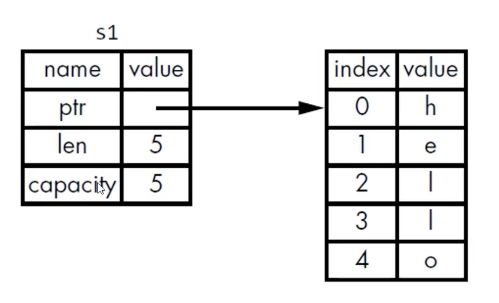
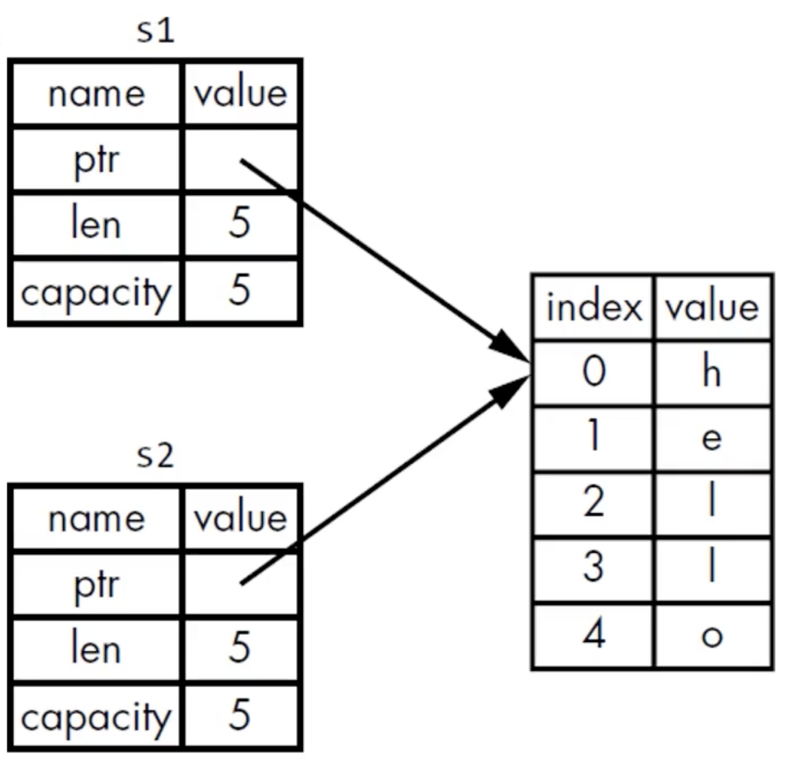

# 所有权规则

- 每个值都有一个变量，这个变量是该值的所有者

- 每个值同时只能有一个所有者

- 当所有者超出作用域的时候，该值将被删除


## 1. 变量的作用域（scope）

scope就是程序中一个项目的有效范围，如下代码

```rust
fn main() {
    // s不用
    let s = "hello"; // s可用
                     // 可以对 s 进行操作
} // s的作用域到此结束，s不再可用
```

### 1.1. String类型

- String比那些基础标量数据类型更复杂

- 字符串字面值：程序里手写的那些字符串值，它们是不可变的

- Rust还有第二种字符串类型：String，在heap上分配，能够存储在编译时未知数量的文本


可以使用 from 函数从字符串字面值创建出 String 类型，如下例子

```rust
let s = String::from("hello");
```

`::` 表示 from 是String类型下的函数，这类字符串是可以被修改的，如下代码

```rust
fn main() {
    let mut s = String::from("hello");
    s.push_str(", world!");
    println!("{}", s);
}
```

为什么 String 类型的值可以被修改，而字符串字面值却不能修改呢？

因为它们处理内存的方式不同。

- 对于字符串字面值，在编译时就知道它的内容了，其中文本内容直接被硬编码到最终的可执行文件里。因为其不可变性，所以速度快、高效。

- 对于String类型，为了支持可变性，需要在heap上分配内存来保存编译时未知的文本内容。操作系统必须在运行时来请求内存，这步是通过调用 `String::from` 来实现，当用完String之后，需要使用某种方式将内存返回给操作系统。这一步，在拥有GC的语言中，GC会跟踪并清理不再使用的内存。没有GC，就需要我们去识别内存何时不再使用，并调用代码将它返回。如果忘了，那就量费内存；如果提前做了，变量就会非法；如果做了两次，也是导致bug，必须一次分配对应一次释放。


Rust采用了不同的内存回收方式，对于某个值来说，当拥有它的变量走出作用范围时，内存会立即自动地交还给操作系统（立即释放）。当变量走出作用域之后，会调用`drop`函数。


### 1.2. 变量和数据的交互方式：移动（Move）


**整型数据的赋值**

多个变量可以与一个数据使用一种独特的方式来交互，如下代码

```rust
fn main() {
    let x = 5;
    let y = x;
}
```

整数时已知且固定大小的简单的值，这两个5被压到了stack中。


**String的赋值**

```rust
fn main() {
    let s1 = String::from("hello");
    let s2 = s1;
}
```

虽然代码与上一个代码示例很相似，但是运行方式时完全不一样的。一个String由3部分组成：

- 指向存放字符串内容的内存的指针

- 字符串的长度

- 字符串的容量


上面这些数据放在 stack 上，而字符串真正的内容在 heap 上，长度（len）是存放字符串内容所需的字节数，容量（capacity）是指 String 从操作系统总共获得内存的总字节数。如下图





- 当 s1 赋给 s2 ，String 的数据被复制了一份：在stack 上复制了一份指针、长度、容量，并没有复制指针所指向的heap上的数据，也就是说 rust 没有复制被分配的内存，如下图



根据rust的特性，当变量离开作用域时，Rust会自动调用`drop`函数，并将变量使用的heap内存释放，那么按照上图的模型，当s1、s2离开作用域时，它们都会尝试释放相同的内存，即导致二次释放（double free）bug。


不过，为了保证内存安全，当 s1 赋给 s2 后，rust 会让 s1 失效。当s1离开作用域的时候，rust不需要释放任何内存。


如果我们编译以下代码，将会报错，因为s1 赋给 s2 后，s1已经失效

```rust
fn main() {
    let s1 = String::from("hello");
    let s2 = s1;

    print!("{}", s1);
}
```

**总结**

- 浅拷贝（shallow copy）：浅拷贝只复制指向某个数据的指针，而不复制数据本身，新旧数据还是共享同一块内存


- 深拷贝（deep copy）：深拷贝会另外创造一个一模一样的数据，新数据跟原数据不共享内存，修改新数据不会改到原数据


但由于rust的赋值让旧变量失效了，所以说我们使用一个新的术语：移动（Move）。这隐含了一个rust的设计原则：Rust不会自动创建数据的深拷贝，就运行时性能而言，任何自动赋值的操作都是廉价的。

如果真想对heap上的String数据进行深度拷贝，而不仅仅是stack上的数据，可以使用clone方法，如下代码

```rust
fn main() {
    let s1 = String::from("hello");
    let s2 = s1.clone();

    println!("s1 = {}, s2 = {}", s1, s2);
}
```

克隆的操作是比较消耗资源的，主要针对heap上的数据。


针对于已知类型和大小的数据，数据在stack上，在变量赋值的时候直接在 stack 上进行数据的复制，变量赋值过后不会影响旧变量的使用，如下代码

```rust
fn main() {
    let x = 5;
    let y = x;

    print!("{}, {}", x, y);
}
```

以上的代码中x对y进行了浅拷贝，与调用clone函数在行为上没有任何差别。


rust提供了一个copy trait，可以用于像整数这样完全放在 stack 上面的类型，如果一个类型实现了copy这个trait，那么旧的变量在赋值后仍然可用。如果一个类型或者该类型的一部分实现了 drop trait ，那么rust不允许它再去实现 copy trait 了。


任何简单标量的组合类型都可以是copy的，任何需要分配内存或某种资源的都不是copy的。一些拥有copy trait的类型如下：


- 所有的整数类型，例如 u32

- bool

- char

- 所有浮点数类型，例如 f64

- tuple(元组)，如果其他所有字段都是 copy 的，如 `(i32, i32)`是， `(i32, string)`不是


